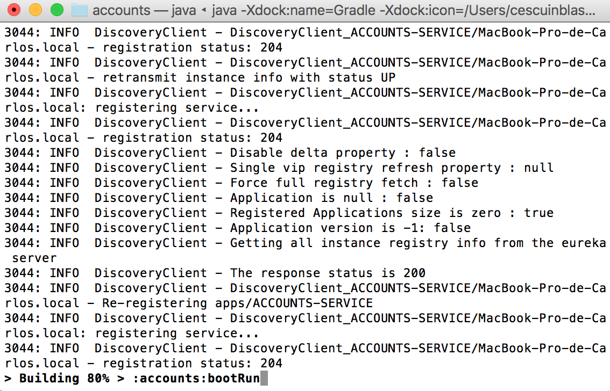
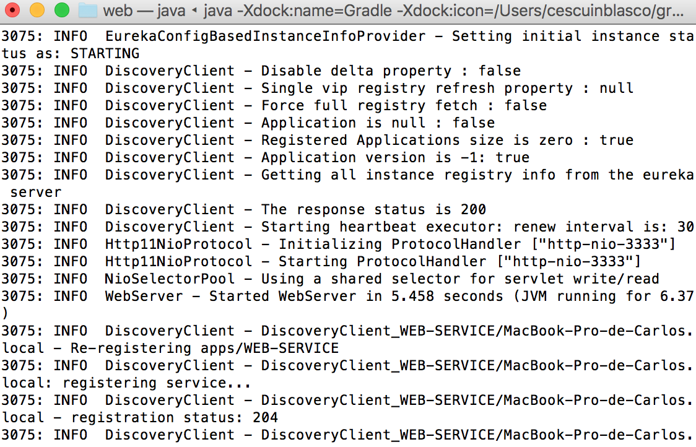
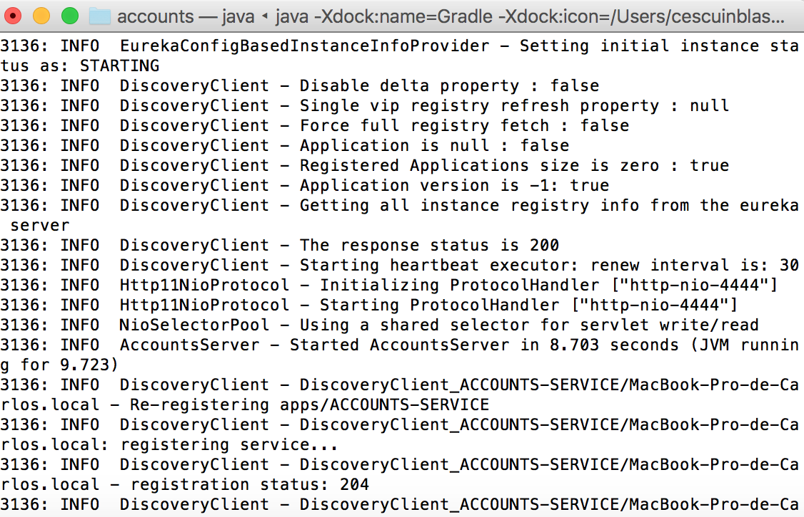

# Web Engineering 2015-2016 / Microservices

## Accounts and web services registered

## Registration server has two services registered

## Another server accounts added in port: 4444

## What's up killing account microservice in 2222?
When 2222 accounts microservice is killed, the registration server notices that there is another accounts service in port 4444. So that, the system keeps working on well.